ex1_01.ext.R
================

``` r
################################################################################
# Updated version of the R code for the analysis in:
#
#   "A penalized framework for distributed lag non-linear models"
#   Biometrics, 2017
#   Antonio Gasparrini, Fabian Scheipl, Ben Amstrong, and Michael G. Kenward
#   http://www.ag-myresearch.com/2017_gasparrini_biomet.html
#
# Update: 15 Jan 2017
# * an up-to-date version of this code is available at:
#   https://github.com/gasparrini/2017_gasparrini_biomet_Rcodedata
################################################################################

################################################################################
# FIRST EXAMPLE
# LOAD THE DATA AND RUN THE MODELS (EXTERNAL METHOD)
################################################################################

# LOAD PACKAGES AND FUNCTIONS
library(dlnm) ; library(mgcv) ; library(splines) ; library(tsModel)
library(tidyverse); library(here)
```

    ## Warning: package 'here' was built under R version 4.5.2

    ## here() starts at C:/Users/qus7tm/Documents/git/gasparrini_2017_gasparrini_Biomet_Rcodedata

# LOAD DATA

``` r
(london <- read.csv(here("example1/london.csv")) %>% tibble())
```

    ## # A tibble: 5,113 × 13
    ##    date        year month   day  time  yday dow    tmean  tmin  tmax   dewp    rh death
    ##    <chr>      <int> <int> <int> <int> <int> <chr>  <dbl> <dbl> <dbl>  <dbl> <dbl> <int>
    ##  1 1993-01-01  1993     1     1     1     1 Fri    4.63   1.57  7.67  2.39   79.4   233
    ##  2 1993-01-02  1993     1     2     2     2 Sat   -0.168 -2.76  2.40 -1.50   85.9   228
    ##  3 1993-01-03  1993     1     3     3     3 Sun   -0.875 -5.16  3.40 -5.22   69.4   228
    ##  4 1993-01-04  1993     1     4     4     4 Mon    2.48  -1.99  6.94  2.04   88.2   223
    ##  5 1993-01-05  1993     1     5     5     5 Tue    7.45   3.45 11.4   8.63   94.0   246
    ##  6 1993-01-06  1993     1     6     6     6 Wed    9.95   7.78 12.1  10.1    90.0   242
    ##  7 1993-01-07  1993     1     7     7     7 Thu    6.98   2.92 11.0   5.93   93.6   226
    ##  8 1993-01-08  1993     1     8     8     8 Fri    7.34   3.43 11.2   0.177  67.0   218
    ##  9 1993-01-09  1993     1     9     9     9 Sat    7.91   3.65 12.2   8.93   84.8   212
    ## 10 1993-01-10  1993     1    10    10    10 Sun    9.92   7.79 12.1   9.63   89.4   218
    ## # ℹ 5,103 more rows

``` r
################################################################################
```

# GLM WITH KNOTS SPECIFIED A PRIORI (GASPARRINI BMCmrm 2014)

## DEFINE THE CROSS-BASIS

``` r
vk <- equalknots(london$tmean,nk=2)
vk
```

    ## [1]  7.69568 18.44617

``` r
lk <- logknots(25,nk=3)
lk
```

    ## [1] 1.056244 3.032653 8.707257

``` r
cbglm1 <- crossbasis(london$tmean,
                     lag = 25,
                     argvar = list(fun = "bs", degree = 2, knots = vk),
                     arglag = list(knots = lk))
summary(cbglm1)
```

    ## CROSSBASIS FUNCTIONS
    ## observations: 5113 
    ## range: -3.054811 to 29.19666 
    ## lag period: 0 25 
    ## total df:  20 
    ## 
    ## BASIS FOR VAR:
    ## fun: bs 
    ## knots: 7.69568 18.44617 
    ## degree: 2 
    ## intercept: FALSE 
    ## Boundary.knots: -3.054811 29.19666 
    ## 
    ## BASIS FOR LAG:
    ## fun: ns 
    ## knots: 1.056244 3.032653 8.707257 
    ## intercept: TRUE 
    ## Boundary.knots: 0 25

## RUN THE MODEL AND PREDICT

``` r
glm1 <- glm(death ~ cbglm1 + ns(time, 10 * 14) + dow, 
            family = quasipoisson(), 
            data = london)

pred3dglm1 <- crosspred(cbglm1, glm1, at = -3:29, cen = 20)
predslglm1 <- crosspred(cbglm1, glm1, by = 0.2, bylag = 0.2, cen = 20)
```

## PLOTS

``` r
plot(pred3dglm1,
     xlab = "Temperature (C)",
     zlab = "RR",
     zlim = c(0.88, 1.45),
     xlim = c(-5, 30),
     ltheta = 170,
     phi = 35,
     lphi = 30,
     main = "Original GLM")
```

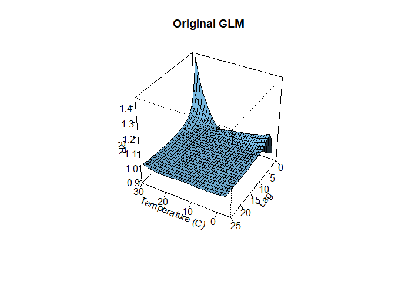<!-- -->

``` r
plot(predslglm1,
     "overall",
     ylab = "RR",
     xlab = "Temperature (C)",
     xlim = c(-5, 30),
     ylim = c(0.5, 3.5),
     lwd = 1.5,
     main = "Original GLM")
```

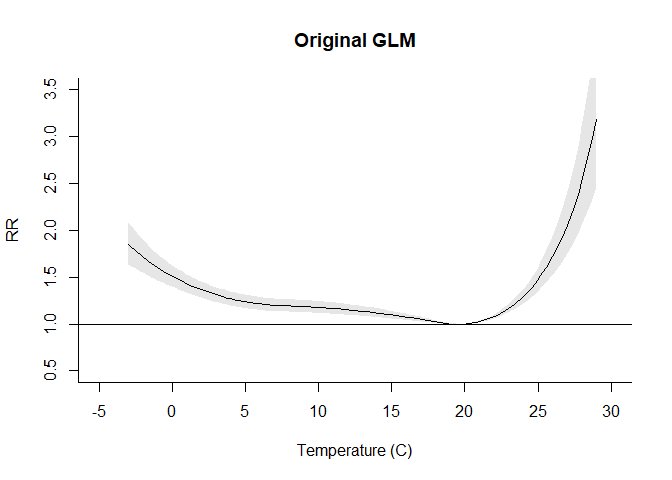<!-- -->

``` r
plot(predslglm1,
     var = 29,
     xlab = "Lag (days)",
     ylab = "RR",
     ylim = c(0.9, 1.4),
     lwd = 1.5,
     main = "Original GLM")
```

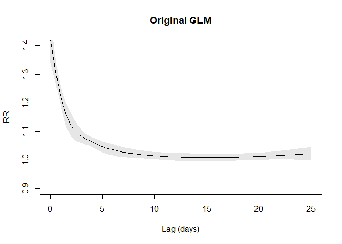<!-- -->

``` r
################################################################################
```

# GLM WITH AIC-BASED KNOT SELECTION

Q-AIC FUNCTION

``` r
fqaic <- function(model) {
  loglik <- sum(dpois(model$y, model$fitted.values, log = TRUE))
  phi <- summary(model)$dispersion
  qaic <- -2 * loglik + 2 * summary(model)$df[3] * phi
  return(qaic)
}
```

KNOTS GRID

``` r
grid <- as.matrix(expand.grid(var = 1:8, lag = 1:8))
grid
```

    ##       var lag
    ##  [1,]   1   1
    ##  [2,]   2   1
    ##  [3,]   3   1
    ##  [4,]   4   1
    ##  [5,]   5   1
    ##  [6,]   6   1
    ##  [7,]   7   1
    ##  [8,]   8   1
    ##  [9,]   1   2
    ## [10,]   2   2
    ## [11,]   3   2
    ## [12,]   4   2
    ## [13,]   5   2
    ## [14,]   6   2
    ## [15,]   7   2
    ## [16,]   8   2
    ## [17,]   1   3
    ## [18,]   2   3
    ## [19,]   3   3
    ## [20,]   4   3
    ## [21,]   5   3
    ## [22,]   6   3
    ## [23,]   7   3
    ## [24,]   8   3
    ## [25,]   1   4
    ## [26,]   2   4
    ## [27,]   3   4
    ## [28,]   4   4
    ## [29,]   5   4
    ## [30,]   6   4
    ## [31,]   7   4
    ## [32,]   8   4
    ## [33,]   1   5
    ## [34,]   2   5
    ## [35,]   3   5
    ## [36,]   4   5
    ## [37,]   5   5
    ## [38,]   6   5
    ## [39,]   7   5
    ## [40,]   8   5
    ## [41,]   1   6
    ## [42,]   2   6
    ## [43,]   3   6
    ## [44,]   4   6
    ## [45,]   5   6
    ## [46,]   6   6
    ## [47,]   7   6
    ## [48,]   8   6
    ## [49,]   1   7
    ## [50,]   2   7
    ## [51,]   3   7
    ## [52,]   4   7
    ## [53,]   5   7
    ## [54,]   6   7
    ## [55,]   7   7
    ## [56,]   8   7
    ## [57,]   1   8
    ## [58,]   2   8
    ## [59,]   3   8
    ## [60,]   4   8
    ## [61,]   5   8
    ## [62,]   6   8
    ## [63,]   7   8
    ## [64,]   8   8

SEARCH (TAKES ~40sec IN A 2.4 GHz PC)

``` r
system.time({
  aicval <- sapply(seq(nrow(grid)), function(i) {
    vk <- equalknots(london$tmean, nk = grid[i, 1])
    lk <- logknots(25, nk = grid[i, 2])
    cb <- crossbasis(london$tmean,
                     lag = 25,
                     argvar = list(fun = "bs", degree = 2, knots = vk),
                     arglag = list(knots = lk))
    m <- glm(death ~ cb + ns(time, 10 * 14) + dow,
             family = quasipoisson(),
             data = london)
    return(fqaic(m))
  })
})
```

    ##    user  system elapsed 
    ##   21.39    0.69   22.30

BEST FITTING MODEL

``` r
(best <- grid[which.min(aicval), ])
```

    ## var lag 
    ##   8   7

``` r
plot(aicval, col = 2, pch = 19)
```

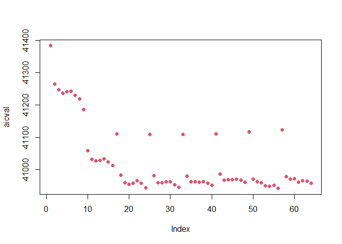<!-- -->

## DEFINE THE CROSS-BASIS

``` r
vk <- equalknots(london$tmean, nk = best[1])
vk
```

    ## [1]  0.5286857  4.1121826  7.6956795 11.2791764 14.8626733 18.4461703 22.0296672 25.6131641

``` r
lk <- logknots(25, nk = best[2])
lk
```

    ## [1]  0.6233541  1.0562437  1.7897545  3.0326533  5.1386859  8.7072575 14.7540312

``` r
cbglm2 <- crossbasis(london$tmean,
                     lag = 25, 
                     argvar = list(fun = "bs", degree = 2, knots = vk),
                     arglag = list(knots = lk))
summary(cbglm2)
```

    ## CROSSBASIS FUNCTIONS
    ## observations: 5113 
    ## range: -3.054811 to 29.19666 
    ## lag period: 0 25 
    ## total df:  90 
    ## 
    ## BASIS FOR VAR:
    ## fun: bs 
    ## knots: 0.5286857 4.112183 7.69568 11.27918 14.86267 18.44617 22.02967 ... 
    ## degree: 2 
    ## intercept: FALSE 
    ## Boundary.knots: -3.054811 29.19666 
    ## 
    ## BASIS FOR LAG:
    ## fun: ns 
    ## knots: 0.6233541 1.056244 1.789754 3.032653 5.138686 8.707257 14.75403 ... 
    ## intercept: TRUE 
    ## Boundary.knots: 0 25

## RUN THE MODEL AND PREDICT

``` r
glm2 <- glm(death ~ cbglm2 + ns(time, 10 * 14) + dow,
            family = quasipoisson(),
            london)

pred3dglm2 <- crosspred(cbglm2, glm2, at = -3:29, cen = 20)
predslglm2 <- crosspred(cbglm2, glm2, by = 0.2, bylag = 0.2, cen = 20)
```

## PLOTS

``` r
plot(pred3dglm2,
     xlab = "Temperature (C)",
     zlab = "RR",
     zlim = c(0.88, 1.45), 
     xlim = c(-5, 30),
     ltheta = 170,
     phi = 35,
     lphi = 30,
     main = "GLM with AIC-based knot selection")
```

    ## Warning in persp.default(ticktype = "detailed", theta = 210, phi = 35, xlab = "Temperature
    ## (C)", : surface extends beyond the box

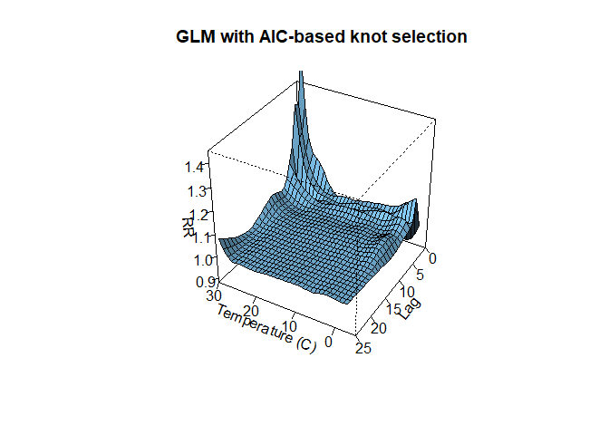<!-- -->

``` r
plot(predslglm2,
     "overall",
     ylab = "RR",
     xlab = "Temperature (C)",
     xlim = c(-5, 30),
     ylim = c(0.5, 3.5),
     lwd = 1.5,
     main = "GLM with AIC-based knot selection")
```

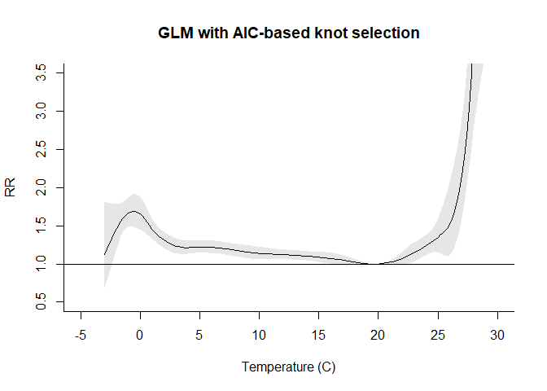<!-- -->

``` r
plot(predslglm2,
     var = 29,
     xlab = "Lag (days)",
     ylab = "RR",
     ylim = c(0.9, 1.4),
     lwd = 1.5,
     main = "GLM with AIC-based knot selection")
```

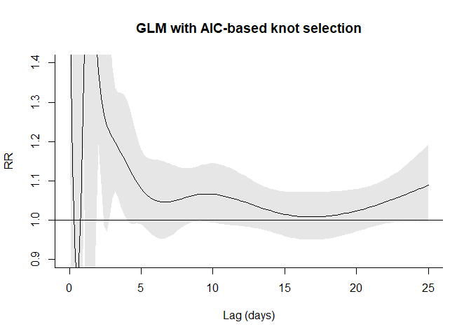<!-- -->

``` r
################################################################################
```

# GAM WITH DEFAULT PENALTIES

## DEFINE THE CROSS-BASIS

NB: df IN argvar SET TO 9, AS INTERCEPT IS EXCLUDED AUTOMATICALLY (FOR
COMPATIBILITY WITH INTERNAL METHOD)

``` r
cbgam1 <- crossbasis(london$tmean,
                     lag = 25,
                     argvar = list(fun = "ps", df = 9),
                     arglag = list(fun = "ps", df = 10))

summary(cbgam1)
```

    ## CROSSBASIS FUNCTIONS
    ## observations: 5113 
    ## range: -3.054811 to 29.19666 
    ## lag period: 0 25 
    ## total df:  90 
    ## 
    ## BASIS FOR VAR:
    ## fun: ps 
    ## df: 9 
    ## knots: -16.93677 -12.3202 -7.703631 -3.087063 1.529505 6.146073 10.76264 ... 
    ## degree: 3 
    ## intercept: FALSE 
    ## fx: FALSE 
    ## S: 5 -4 1 0 0 0 0 ... 
    ## diff: 2 
    ## 
    ## BASIS FOR LAG:
    ## fun: ps 
    ## df: 10 
    ## knots: -10.76071 -7.182143 -3.603571 -0.025 3.553571 7.132143 10.71071 ... 
    ## degree: 3 
    ## intercept: TRUE 
    ## fx: FALSE 
    ## S: 1 -2 1 0 0 0 0 ... 
    ## diff: 2

## DEFINE THE PENALTY MATRICES

``` r
cbgam1Pen <- cbPen(cbgam1)
```

## RUN THE GAM MODEL AND PREDICT (TAKES ~34sec IN A 2.4 GHz PC)

``` r
system.time({
  gam1 <- gam(death ~ cbgam1 + ns(time, 10 * 14) + dow,
              family = quasipoisson(),
              london,
              paraPen = list(cbgam1 = cbgam1Pen), method = "REML")
})
```

    ##    user  system elapsed 
    ##   18.18    0.24   18.44

``` r
pred3dgam1 <- crosspred(cbgam1, gam1, at = -3:29, cen = 20)
predslgam1 <- crosspred(cbgam1, gam1, by = 0.2, bylag = 0.2, cen = 20)
```

CHECK CONVERGENCE, SMOOTHING PARAMETERS AND EDF

``` r
gam1$converged
```

    ## [1] TRUE

``` r
gam1$sp
```

    ##      cbgam11      cbgam12 
    ## 14176.823703     3.349455

``` r
sum(gam1$edf[2:91])
```

    ## [1] 43.55123

## PLOTS

``` r
plot(pred3dgam1,
     xlab = "Temperature (C)",
     zlab = "RR",
     zlim = c(0.88, 1.45),
     xlim = c(-5, 30),
     ltheta = 170,
     phi = 35,
     lphi = 30,
     main = "GAM with default penalties")
```

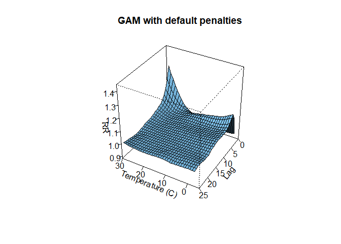<!-- -->

``` r
plot(predslgam1,
     "overall",
     ylab = "RR",
     xlab = "Temperature (C)",
     xlim = c(-5, 30),
     ylim = c(0.5, 3.5),
     lwd = 1.5,
     main = "GAM with default penalties")
```

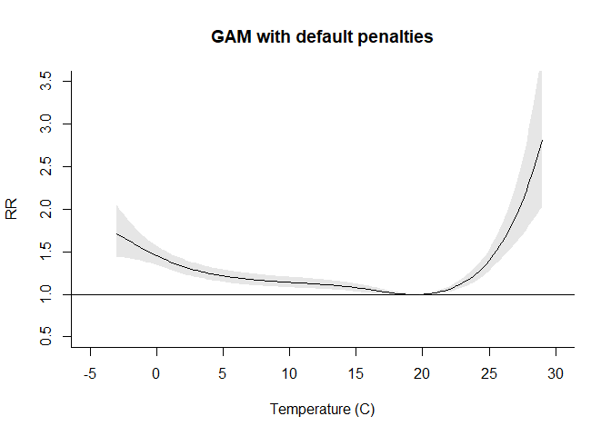<!-- -->

``` r
plot(predslgam1,
     var = 29,
     xlab = "Lag (days)",
     ylab = "RR",
     ylim = c(0.9, 1.4),
     lwd = 1.5,
     main = "GAM with default penalties")
```

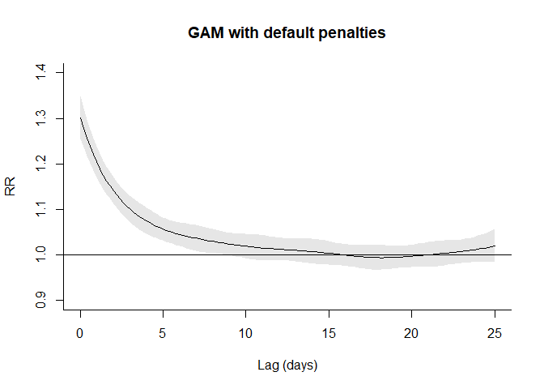<!-- -->

``` r
################################################################################
```

# GAM WITH DOUBLY VARYING PENALTY ON THE LAG

## DEFINE THE CROSS-BASIS

PS: EXCLUDE THE DEFAULT PENALTY FROM THE LAG-RESPONSE FUNCTION WITH fx=T

``` r
cbgam2 <- crossbasis(london$tmean,
                     lag = 25,
                     argvar = list(fun = "ps", df = 9),
                     arglag = list(fun = "ps", df = 10, fx = T))
summary(cbgam2)
```

    ## CROSSBASIS FUNCTIONS
    ## observations: 5113 
    ## range: -3.054811 to 29.19666 
    ## lag period: 0 25 
    ## total df:  90 
    ## 
    ## BASIS FOR VAR:
    ## fun: ps 
    ## df: 9 
    ## knots: -16.93677 -12.3202 -7.703631 -3.087063 1.529505 6.146073 10.76264 ... 
    ## degree: 3 
    ## intercept: FALSE 
    ## fx: FALSE 
    ## S: 5 -4 1 0 0 0 0 ... 
    ## diff: 2 
    ## 
    ## BASIS FOR LAG:
    ## fun: ps 
    ## df: 10 
    ## knots: -10.76071 -7.182143 -3.603571 -0.025 3.553571 7.132143 10.71071 ... 
    ## degree: 3 
    ## intercept: TRUE 
    ## fx: TRUE 
    ## diff: 2

## DEFINE THE DOUBLY VARYING PENALTY MATRICES

VARYING DIFFERENCE PENALTY APPLIED TO LAGS (EQ. 8b)

``` r
C <- do.call("onebasis", c(list(x = 0:25, fun = "ps", df = 10, intercept = T)))
C
```

    ##                 b1           b2          b3           b4           b5           b6
    ##  [1,] 0.1631979982 6.666180e-01 0.170183912 5.682503e-08 0.0000000000 0.0000000000
    ##  [2,] 0.0605569105 5.963755e-01 0.339151180 3.916438e-03 0.0000000000 0.0000000000
    ##  [3,] 0.0136368278 4.370572e-01 0.519106785 3.019915e-02 0.0000000000 0.0000000000
    ##  [4,] 0.0006169368 2.541258e-01 0.644588290 1.006690e-01 0.0000000000 0.0000000000
    ##  [5,] 0.0000000000 1.117492e-01 0.652074706 2.358525e-01 0.0003235755 0.0000000000
    ##  [6,] 0.0000000000 3.525077e-02 0.536312370 4.174313e-01 0.0110055222 0.0000000000
    ##  [7,] 0.0000000000 5.277441e-03 0.359062100 5.824107e-01 0.0532497164 0.0000000000
    ##  [8,] 0.0000000000 8.391716e-06 0.185786336 6.653283e-01 0.1488769713 0.0000000000
    ##  [9,] 0.0000000000 0.000000e+00 0.072438744 6.149847e-01 0.3101993287 0.0023771928
    ## [10,] 0.0000000000 0.000000e+00 0.018207576 4.653289e-01 0.4927634119 0.0237001258
    ## [11,] 0.0000000000 0.000000e+00 0.001305584 2.817728e-01 0.6311403487 0.0857812204
    ## [12,] 0.0000000000 0.000000e+00 0.000000000 1.294269e-01 0.6603959647 0.2100891131
    ## [13,] 0.0000000000 0.000000e+00 0.000000000 4.363346e-02 0.5602477565 0.3883246595
    ## [14,] 0.0000000000 0.000000e+00 0.000000000 7.794122e-03 0.3883246595 0.5602477565
    ## [15,] 0.0000000000 0.000000e+00 0.000000000 8.804418e-05 0.2100891131 0.6603959647
    ## [16,] 0.0000000000 0.000000e+00 0.000000000 0.000000e+00 0.0857812204 0.6311403487
    ## [17,] 0.0000000000 0.000000e+00 0.000000000 0.000000e+00 0.0237001258 0.4927634119
    ## [18,] 0.0000000000 0.000000e+00 0.000000000 0.000000e+00 0.0023771928 0.3101993287
    ## [19,] 0.0000000000 0.000000e+00 0.000000000 0.000000e+00 0.0000000000 0.1488769713
    ## [20,] 0.0000000000 0.000000e+00 0.000000000 0.000000e+00 0.0000000000 0.0532497164
    ## [21,] 0.0000000000 0.000000e+00 0.000000000 0.000000e+00 0.0000000000 0.0110055222
    ## [22,] 0.0000000000 0.000000e+00 0.000000000 0.000000e+00 0.0000000000 0.0003235755
    ## [23,] 0.0000000000 0.000000e+00 0.000000000 0.000000e+00 0.0000000000 0.0000000000
    ## [24,] 0.0000000000 0.000000e+00 0.000000000 0.000000e+00 0.0000000000 0.0000000000
    ## [25,] 0.0000000000 0.000000e+00 0.000000000 0.000000e+00 0.0000000000 0.0000000000
    ## [26,] 0.0000000000 0.000000e+00 0.000000000 0.000000e+00 0.0000000000 0.0000000000
    ##                 b7          b8           b9          b10
    ##  [1,] 0.000000e+00 0.000000000 0.000000e+00 0.0000000000
    ##  [2,] 0.000000e+00 0.000000000 0.000000e+00 0.0000000000
    ##  [3,] 0.000000e+00 0.000000000 0.000000e+00 0.0000000000
    ##  [4,] 0.000000e+00 0.000000000 0.000000e+00 0.0000000000
    ##  [5,] 0.000000e+00 0.000000000 0.000000e+00 0.0000000000
    ##  [6,] 0.000000e+00 0.000000000 0.000000e+00 0.0000000000
    ##  [7,] 0.000000e+00 0.000000000 0.000000e+00 0.0000000000
    ##  [8,] 0.000000e+00 0.000000000 0.000000e+00 0.0000000000
    ##  [9,] 0.000000e+00 0.000000000 0.000000e+00 0.0000000000
    ## [10,] 0.000000e+00 0.000000000 0.000000e+00 0.0000000000
    ## [11,] 0.000000e+00 0.000000000 0.000000e+00 0.0000000000
    ## [12,] 8.804418e-05 0.000000000 0.000000e+00 0.0000000000
    ## [13,] 7.794122e-03 0.000000000 0.000000e+00 0.0000000000
    ## [14,] 4.363346e-02 0.000000000 0.000000e+00 0.0000000000
    ## [15,] 1.294269e-01 0.000000000 0.000000e+00 0.0000000000
    ## [16,] 2.817728e-01 0.001305584 0.000000e+00 0.0000000000
    ## [17,] 4.653289e-01 0.018207576 0.000000e+00 0.0000000000
    ## [18,] 6.149847e-01 0.072438744 0.000000e+00 0.0000000000
    ## [19,] 6.653283e-01 0.185786336 8.391716e-06 0.0000000000
    ## [20,] 5.824107e-01 0.359062100 5.277441e-03 0.0000000000
    ## [21,] 4.174313e-01 0.536312370 3.525077e-02 0.0000000000
    ## [22,] 2.358525e-01 0.652074706 1.117492e-01 0.0000000000
    ## [23,] 1.006690e-01 0.644588290 2.541258e-01 0.0006169368
    ## [24,] 3.019915e-02 0.519106785 4.370572e-01 0.0136368278
    ## [25,] 3.916438e-03 0.339151180 5.963755e-01 0.0605569105
    ## [26,] 5.682503e-08 0.170183912 6.666180e-01 0.1631979982
    ## attr(,"fun")
    ## [1] "ps"
    ## attr(,"df")
    ## [1] 10
    ## attr(,"knots")
    ##  [1] -10.760714  -7.182143  -3.603571  -0.025000   3.553571   7.132143  10.710714  14.289286
    ##  [9]  17.867857  21.446429  25.025000  28.603571  32.182143  35.760714
    ## attr(,"degree")
    ## [1] 3
    ## attr(,"intercept")
    ## [1] TRUE
    ## attr(,"fx")
    ## [1] FALSE
    ## attr(,"S")
    ##       [,1] [,2] [,3] [,4] [,5] [,6] [,7] [,8] [,9] [,10]
    ##  [1,]    1   -2    1    0    0    0    0    0    0     0
    ##  [2,]   -2    5   -4    1    0    0    0    0    0     0
    ##  [3,]    1   -4    6   -4    1    0    0    0    0     0
    ##  [4,]    0    1   -4    6   -4    1    0    0    0     0
    ##  [5,]    0    0    1   -4    6   -4    1    0    0     0
    ##  [6,]    0    0    0    1   -4    6   -4    1    0     0
    ##  [7,]    0    0    0    0    1   -4    6   -4    1     0
    ##  [8,]    0    0    0    0    0    1   -4    6   -4     1
    ##  [9,]    0    0    0    0    0    0    1   -4    5    -2
    ## [10,]    0    0    0    0    0    0    0    1   -2     1
    ## attr(,"diff")
    ## [1] 2
    ## attr(,"class")
    ## [1] "onebasis" "matrix"  
    ## attr(,"range")
    ## [1]  0 25

``` r
D <- diff(diag(25 + 1), diff = 2)
D
```

    ##       [,1] [,2] [,3] [,4] [,5] [,6] [,7] [,8] [,9] [,10] [,11] [,12] [,13] [,14] [,15] [,16]
    ##  [1,]    1   -2    1    0    0    0    0    0    0     0     0     0     0     0     0     0
    ##  [2,]    0    1   -2    1    0    0    0    0    0     0     0     0     0     0     0     0
    ##  [3,]    0    0    1   -2    1    0    0    0    0     0     0     0     0     0     0     0
    ##  [4,]    0    0    0    1   -2    1    0    0    0     0     0     0     0     0     0     0
    ##  [5,]    0    0    0    0    1   -2    1    0    0     0     0     0     0     0     0     0
    ##  [6,]    0    0    0    0    0    1   -2    1    0     0     0     0     0     0     0     0
    ##  [7,]    0    0    0    0    0    0    1   -2    1     0     0     0     0     0     0     0
    ##  [8,]    0    0    0    0    0    0    0    1   -2     1     0     0     0     0     0     0
    ##  [9,]    0    0    0    0    0    0    0    0    1    -2     1     0     0     0     0     0
    ## [10,]    0    0    0    0    0    0    0    0    0     1    -2     1     0     0     0     0
    ## [11,]    0    0    0    0    0    0    0    0    0     0     1    -2     1     0     0     0
    ## [12,]    0    0    0    0    0    0    0    0    0     0     0     1    -2     1     0     0
    ## [13,]    0    0    0    0    0    0    0    0    0     0     0     0     1    -2     1     0
    ## [14,]    0    0    0    0    0    0    0    0    0     0     0     0     0     1    -2     1
    ## [15,]    0    0    0    0    0    0    0    0    0     0     0     0     0     0     1    -2
    ## [16,]    0    0    0    0    0    0    0    0    0     0     0     0     0     0     0     1
    ## [17,]    0    0    0    0    0    0    0    0    0     0     0     0     0     0     0     0
    ## [18,]    0    0    0    0    0    0    0    0    0     0     0     0     0     0     0     0
    ## [19,]    0    0    0    0    0    0    0    0    0     0     0     0     0     0     0     0
    ## [20,]    0    0    0    0    0    0    0    0    0     0     0     0     0     0     0     0
    ## [21,]    0    0    0    0    0    0    0    0    0     0     0     0     0     0     0     0
    ## [22,]    0    0    0    0    0    0    0    0    0     0     0     0     0     0     0     0
    ## [23,]    0    0    0    0    0    0    0    0    0     0     0     0     0     0     0     0
    ## [24,]    0    0    0    0    0    0    0    0    0     0     0     0     0     0     0     0
    ##       [,17] [,18] [,19] [,20] [,21] [,22] [,23] [,24] [,25] [,26]
    ##  [1,]     0     0     0     0     0     0     0     0     0     0
    ##  [2,]     0     0     0     0     0     0     0     0     0     0
    ##  [3,]     0     0     0     0     0     0     0     0     0     0
    ##  [4,]     0     0     0     0     0     0     0     0     0     0
    ##  [5,]     0     0     0     0     0     0     0     0     0     0
    ##  [6,]     0     0     0     0     0     0     0     0     0     0
    ##  [7,]     0     0     0     0     0     0     0     0     0     0
    ##  [8,]     0     0     0     0     0     0     0     0     0     0
    ##  [9,]     0     0     0     0     0     0     0     0     0     0
    ## [10,]     0     0     0     0     0     0     0     0     0     0
    ## [11,]     0     0     0     0     0     0     0     0     0     0
    ## [12,]     0     0     0     0     0     0     0     0     0     0
    ## [13,]     0     0     0     0     0     0     0     0     0     0
    ## [14,]     0     0     0     0     0     0     0     0     0     0
    ## [15,]     1     0     0     0     0     0     0     0     0     0
    ## [16,]    -2     1     0     0     0     0     0     0     0     0
    ## [17,]     1    -2     1     0     0     0     0     0     0     0
    ## [18,]     0     1    -2     1     0     0     0     0     0     0
    ## [19,]     0     0     1    -2     1     0     0     0     0     0
    ## [20,]     0     0     0     1    -2     1     0     0     0     0
    ## [21,]     0     0     0     0     1    -2     1     0     0     0
    ## [22,]     0     0     0     0     0     1    -2     1     0     0
    ## [23,]     0     0     0     0     0     0     1    -2     1     0
    ## [24,]     0     0     0     0     0     0     0     1    -2     1

``` r
P <- diag((seq(0, 25 - 2))^2)
P
```

    ##       [,1] [,2] [,3] [,4] [,5] [,6] [,7] [,8] [,9] [,10] [,11] [,12] [,13] [,14] [,15] [,16]
    ##  [1,]    0    0    0    0    0    0    0    0    0     0     0     0     0     0     0     0
    ##  [2,]    0    1    0    0    0    0    0    0    0     0     0     0     0     0     0     0
    ##  [3,]    0    0    4    0    0    0    0    0    0     0     0     0     0     0     0     0
    ##  [4,]    0    0    0    9    0    0    0    0    0     0     0     0     0     0     0     0
    ##  [5,]    0    0    0    0   16    0    0    0    0     0     0     0     0     0     0     0
    ##  [6,]    0    0    0    0    0   25    0    0    0     0     0     0     0     0     0     0
    ##  [7,]    0    0    0    0    0    0   36    0    0     0     0     0     0     0     0     0
    ##  [8,]    0    0    0    0    0    0    0   49    0     0     0     0     0     0     0     0
    ##  [9,]    0    0    0    0    0    0    0    0   64     0     0     0     0     0     0     0
    ## [10,]    0    0    0    0    0    0    0    0    0    81     0     0     0     0     0     0
    ## [11,]    0    0    0    0    0    0    0    0    0     0   100     0     0     0     0     0
    ## [12,]    0    0    0    0    0    0    0    0    0     0     0   121     0     0     0     0
    ## [13,]    0    0    0    0    0    0    0    0    0     0     0     0   144     0     0     0
    ## [14,]    0    0    0    0    0    0    0    0    0     0     0     0     0   169     0     0
    ## [15,]    0    0    0    0    0    0    0    0    0     0     0     0     0     0   196     0
    ## [16,]    0    0    0    0    0    0    0    0    0     0     0     0     0     0     0   225
    ## [17,]    0    0    0    0    0    0    0    0    0     0     0     0     0     0     0     0
    ## [18,]    0    0    0    0    0    0    0    0    0     0     0     0     0     0     0     0
    ## [19,]    0    0    0    0    0    0    0    0    0     0     0     0     0     0     0     0
    ## [20,]    0    0    0    0    0    0    0    0    0     0     0     0     0     0     0     0
    ## [21,]    0    0    0    0    0    0    0    0    0     0     0     0     0     0     0     0
    ## [22,]    0    0    0    0    0    0    0    0    0     0     0     0     0     0     0     0
    ## [23,]    0    0    0    0    0    0    0    0    0     0     0     0     0     0     0     0
    ## [24,]    0    0    0    0    0    0    0    0    0     0     0     0     0     0     0     0
    ##       [,17] [,18] [,19] [,20] [,21] [,22] [,23] [,24]
    ##  [1,]     0     0     0     0     0     0     0     0
    ##  [2,]     0     0     0     0     0     0     0     0
    ##  [3,]     0     0     0     0     0     0     0     0
    ##  [4,]     0     0     0     0     0     0     0     0
    ##  [5,]     0     0     0     0     0     0     0     0
    ##  [6,]     0     0     0     0     0     0     0     0
    ##  [7,]     0     0     0     0     0     0     0     0
    ##  [8,]     0     0     0     0     0     0     0     0
    ##  [9,]     0     0     0     0     0     0     0     0
    ## [10,]     0     0     0     0     0     0     0     0
    ## [11,]     0     0     0     0     0     0     0     0
    ## [12,]     0     0     0     0     0     0     0     0
    ## [13,]     0     0     0     0     0     0     0     0
    ## [14,]     0     0     0     0     0     0     0     0
    ## [15,]     0     0     0     0     0     0     0     0
    ## [16,]     0     0     0     0     0     0     0     0
    ## [17,]   256     0     0     0     0     0     0     0
    ## [18,]     0   289     0     0     0     0     0     0
    ## [19,]     0     0   324     0     0     0     0     0
    ## [20,]     0     0     0   361     0     0     0     0
    ## [21,]     0     0     0     0   400     0     0     0
    ## [22,]     0     0     0     0     0   441     0     0
    ## [23,]     0     0     0     0     0     0   484     0
    ## [24,]     0     0     0     0     0     0     0   529

``` r
Slag1 <- t(C) %*% t(D) %*% P %*% D %*% C
Slag1
```

    ##                b1            b2           b3           b4            b5            b6
    ## b1   1.767982e-03  0.0015772930 -0.008384963  0.004966122  7.356731e-05  0.0000000000
    ## b2   1.577293e-03  0.0970829330 -0.122872712 -0.051354556  7.510905e-02  0.0004579919
    ## b3  -8.384963e-03 -0.1228727117  0.665846429 -0.684288038 -9.444172e-02  0.2430351801
    ## b4   4.966122e-03 -0.0513545556 -0.684288038  2.354530608 -1.962142e+00 -0.1732294755
    ## b5   7.356731e-05  0.0751090494 -0.094441721 -1.962142068  5.376443e+00 -3.9850272419
    ## b6   0.000000e+00  0.0004579919  0.243035180 -0.173229475 -3.985027e+00  9.7670653440
    ## b7   0.000000e+00  0.0000000000  0.001105825  0.509567394 -2.860116e-01 -6.7593422415
    ## b8   0.000000e+00  0.0000000000  0.000000000  0.001950013  8.723424e-01 -0.4333461819
    ## b9   0.000000e+00  0.0000000000  0.000000000  0.000000000  3.654818e-03  1.3360605788
    ## b10  0.000000e+00  0.0000000000  0.000000000  0.000000000  0.000000e+00  0.0043260460
    ##                b7            b8           b9          b10
    ## b1    0.000000000   0.000000000  0.000000000  0.000000000
    ## b2    0.000000000   0.000000000  0.000000000  0.000000000
    ## b3    0.001105825   0.000000000  0.000000000  0.000000000
    ## b4    0.509567394   0.001950013  0.000000000  0.000000000
    ## b5   -0.286011635   0.872342382  0.003654818  0.000000000
    ## b6   -6.759342242  -0.433346182  1.336060579  0.004326046
    ## b7   15.514904402 -10.412505428 -0.317420351  1.749702034
    ## b8  -10.412505428  17.380219525 -6.162950028 -1.245710283
    ## b9   -0.317420351  -6.162950028  7.915644704 -2.774989721
    ## b10   1.749702034  -1.245710283 -2.774989721  2.266671924

VARYING RIDGE PENALTY APPLIED TO COEFFICIENTS (Eq. 7a)

``` r
Slag2 <- diag(rep(0:1, c(6, 4)))
Slag2
```

    ##       [,1] [,2] [,3] [,4] [,5] [,6] [,7] [,8] [,9] [,10]
    ##  [1,]    0    0    0    0    0    0    0    0    0     0
    ##  [2,]    0    0    0    0    0    0    0    0    0     0
    ##  [3,]    0    0    0    0    0    0    0    0    0     0
    ##  [4,]    0    0    0    0    0    0    0    0    0     0
    ##  [5,]    0    0    0    0    0    0    0    0    0     0
    ##  [6,]    0    0    0    0    0    0    0    0    0     0
    ##  [7,]    0    0    0    0    0    0    1    0    0     0
    ##  [8,]    0    0    0    0    0    0    0    1    0     0
    ##  [9,]    0    0    0    0    0    0    0    0    1     0
    ## [10,]    0    0    0    0    0    0    0    0    0     1

``` r
cbgam2Pen <- cbPen(cbgam2, addSlag = list(Slag1, Slag2))
```

## RUN THE GAM MODEL AND PREDICT (TAKES ~14sec IN A 2.4 GHz PC)

``` r
system.time({
  gam2 <- gam(death ~ cbgam2 + ns(time, 10 * 14) + dow,
              family = quasipoisson(), london,
              paraPen = list(cbgam2 = cbgam2Pen),
              method = "REML")
})
```

    ##    user  system elapsed 
    ##    7.31    0.11    7.44

``` r
pred3dgam2 <- crosspred(cbgam2, gam2, at = -3:29, cen = 20)
predslgam2 <- crosspred(cbgam2, gam2, by = 0.2, bylag = 0.2, cen = 20)
```

CHECK CONVERGENCE, SMOOTHING PARAMETERS AND EDF

``` r
gam2$converged
```

    ## [1] TRUE

``` r
gam2$sp
```

    ##   cbgam21   cbgam22   cbgam23 
    ##  2148.671  9191.106 30272.305

``` r
sum(gam2$edf[2:91])
```

    ## [1] 36.54043

## PLOTS

``` r
plot(pred3dgam2,
     xlab = "Temperature (C)",
     zlab = "RR",
     zlim = c(0.88, 1.45),
     xlim = c(-5, 30),
     ltheta = 170,
     phi = 35,
     lphi = 30,
     main = "GAM with doubly varying penalties")
```

<!-- -->

``` r
plot(predslgam2, "overall",
     ylab = "RR",
     xlab = "Temperature (C)",
     xlim = c(-5, 30),
     ylim = c(0.5, 3.5),
     lwd = 1.5,
     main = "GAM with doubly varying penalties")
```

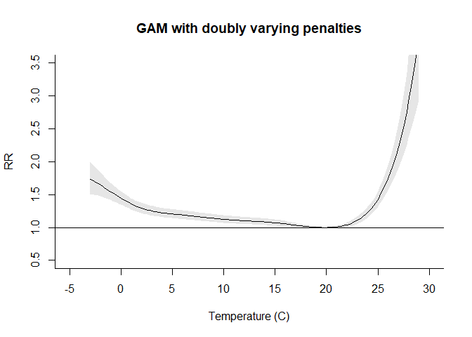<!-- -->

``` r
plot(predslgam2,
     var = 29,
     xlab = "Lag (days)",
     ylab = "RR",
     ylim = c(0.9, 1.4),
     lwd = 1.5,
     main = "GAM with doubly varying penalties")
```

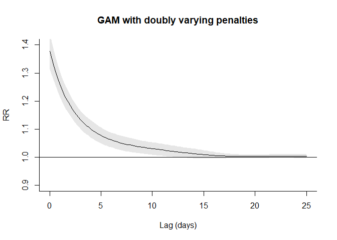<!-- -->

``` r
################################################################################
```

# GAM WITH ONE DIMENSION UNPENALIZED BY USING PARAMETRIC FUNCTIONS

## DEFINE THE CROSS-BASIS

NB: DOUBLE THRESHOLD AS EXPOSURE-RESPONSE

``` r
cbgam3 <- crossbasis(london$tmean,
                     lag = 25,
                     argvar = list(fun = "thr", thr = c(17, 21)),
                     arglag = list(fun = "ps", df = 10))
summary(cbgam3)
```

    ## CROSSBASIS FUNCTIONS
    ## observations: 5113 
    ## range: -3.054811 to 29.19666 
    ## lag period: 0 25 
    ## total df:  20 
    ## 
    ## BASIS FOR VAR:
    ## fun: thr 
    ## thr.value: 17 21 
    ## side: d 
    ## intercept: FALSE 
    ## 
    ## BASIS FOR LAG:
    ## fun: ps 
    ## df: 10 
    ## knots: -10.76071 -7.182143 -3.603571 -0.025 3.553571 7.132143 10.71071 ... 
    ## degree: 3 
    ## intercept: TRUE 
    ## fx: FALSE 
    ## S: 1 -2 1 0 0 0 0 ... 
    ## diff: 2

USE THE PENALTY MATRICES DEFINE ABOVE

``` r
cbgam3Pen <- cbPen(cbgam3, addSlag = list(Slag1, Slag2))
```

## RUN THE GAM MODEL AND PREDICT (TAKES ~75sec IN A 2.4 GHz PC)

``` r
system.time({
  gam3 <- gam(death ~ cbgam3 + ns(time, 10 * 14) + dow,
              family = quasipoisson(),
              data = london,
              paraPen = list(cbgam3 = cbgam3Pen), method = "REML")
})
```

    ##    user  system elapsed 
    ##    9.44    0.08    9.89

``` r
pred3dgam3 <- crosspred(cbgam3, gam3, at = -3:29)
predslgam3 <- crosspred(cbgam3, gam3, by = 0.2, bylag = 0.2)
```

CHECK CONVERGENCE, SMOOTHING PARAMETERS AND EDF

``` r
gam3$converged
```

    ## [1] TRUE

``` r
gam3$sp
```

    ##      cbgam31      cbgam32      cbgam33 
    ## 1.146344e+00 3.056109e+06 1.051644e+07

``` r
sum(gam3$edf[2:21])
```

    ## [1] 10.64349

## PLOTS

``` r
plot(pred3dgam3,
     xlab = "Temperature (C)",
     zlab = "RR",
     zlim = c(0.88, 1.45),
     xlim = c(-5, 30),
     ltheta = 170,
     phi = 35,
     lphi = 30,
     main = "Mix of penalized and unpenalized")
```

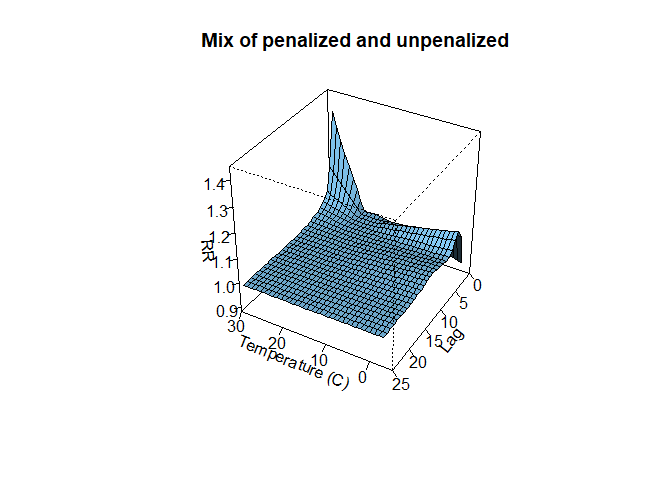<!-- -->

``` r
plot(predslgam3,
     "overall",
     ylab = "RR",
     xlab = "Temperature (C)",
     xlim = c(-5, 30),
     ylim = c(0.8, 2.2),
     lwd = 1.5,
     main = "Mix of penalized and unpenalized")
```

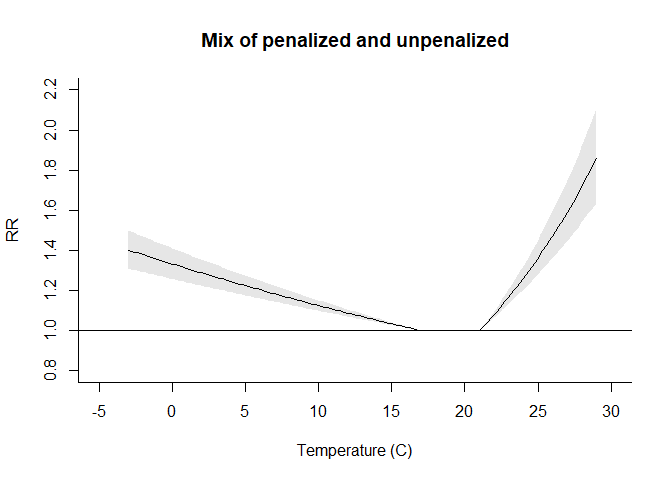<!-- -->

``` r
plot(predslgam3,
     var = 29,
     xlab = "Lag (days)",
     ylab = "RR",
     ylim = c(0.9, 1.4),
     lwd = 1.5,
     main = "Mix of penalized and unpenalized")
```

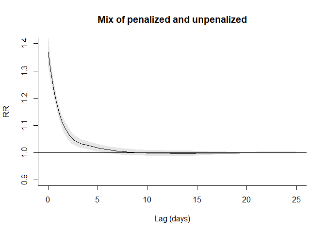<!-- -->
